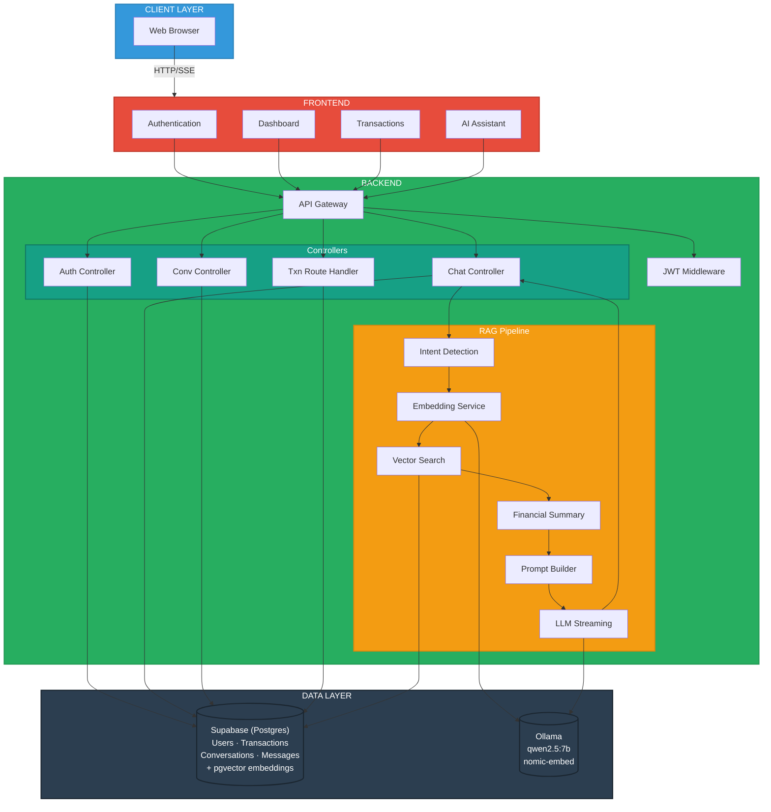

# 💰 RAG Finance Assistant

- A full-stack personal finance web application powered by a **Retrieval-Augmented Generation (RAG)** AI chatbot built with modern web technologies. The platform enables users to manage and analyze their personal financial data through an intuitive dashboard, detailed transaction views, and an intelligent AI assistant.
- Users can sign up, securely authenticate via **JWT-based authentication**, and interact with their financial records in real time. All application data — users, transactions, conversations, messages — lives in a single **Supabase (Postgres)** database. Every transaction is embedded into a **768-dimensional vector** using the **nomic-embed-text** model running locally on **Ollama**, and that vector is stored directly on the transaction row using the **pgvector** extension — no separate vector database required.
- When a user asks the AI assistant a question, the system detects intent — distinguishing between temporal queries (e.g., "last 5 transactions") and semantic queries (e.g., "spending at Amazon"). For semantic queries, the user's question is embedded and matched against stored vectors via a Postgres RPC function (`match_transactions`) using cosine similarity, retrieving the most relevant transactions as context.
- A comprehensive financial summary (total credits, debits, balance, category breakdowns) is dynamically generated and combined with retrieved context to build a rich prompt for the LLM.
- The prompt is sent to a locally hosted **qwen2.5:7b** language model via Ollama, which streams the response token-by-token back to the frontend using **Server-Sent Events (SSE)**.
- The frontend, built with **Next.js**, **React**, **TypeScript**, and **Tailwind CSS**, renders the AI responses in real time, delivering a seamless and responsive conversational experience.

> **Status note:** Authentication, the Transactions page, conversation history, and the AI Assistant are wired to the live Supabase backend. The Dashboard still renders from local mock/constant data and is not yet connected to the live API.


---

## 🏗️ Architecture Diagram


---


## 📁 Folder Structure

```
rag-finance-assistant/
│
├── backend-node/
│   ├── .env                             # Backend environment variables
│   ├── package.json                     # Node.js dependencies
│   ├── server.js                        # Entry point — Express app, route registration
│   └── src/
│       ├── config/
│       │   └── supabase.js              # Supabase client (service role key)
│       ├── controllers/
│       │   ├── authController.js        # Register / Login logic
│       │   ├── chatController.js        # AI chat handler (RAG pipeline)
│       │   ├── conversationController.js # CRUD for conversations
│       ├── middleware/
│       │   └── authMiddleware.js        # JWT verification middleware
│       ├── models/
│       │   ├── User.js                  # User data access (Supabase)
│       │   ├── Transactions.js          # Transaction data access (Supabase)
│       │   └── Conversations.js         # Conversation + message data access (Supabase)
│       ├── routes/
│       │   ├── authRoutes.js            # /api/auth/*
│       │   ├── chatRoutes.js            # /api/chat
│       │   ├── conversationRoutes.js    # /api/conversations/*
│       │   └── transactionRoutes.js     # /api/transactions/*
│       ├── scripts/
│       │   └── ingest.js               # Batch embed transactions, store vectors in Postgres
│       └── utils/
│           ├── aiService.js             # Prompt builder + Ollama LLM streaming
│           ├── embedService.js          # Text → 768-dim vector (nomic-embed-text)
│           ├── financialSummary.js      # Aggregate transactions → financial summary
│           ├── ingestTransactions.js    # Embed & store a single transaction's vector
│           ├── intentDetector.js        # Temporal query detection (last/first N txns)
│           └── retrieveContext.js       # pgvector similarity search (match_transactions RPC)
│
├── frontend/
│   ├── .env                             # Frontend environment variables
│   ├── package.json                     # Next.js dependencies
│   ├── next.config.ts                   # Next.js configuration
│   ├── tsconfig.json                    # TypeScript configuration
│   ├── postcss.config.mjs               # PostCSS (Tailwind)
│   ├── components.json                  # shadcn/ui configuration
│   ├── app/
│   │   ├── (auth)/                      # Login / Register pages
│   │   └── (root)/
│   │       ├── layout.tsx               # Root layout with Sidebar
│   │       ├── dashboard/               # Dashboard page (KPIs + charts) — mock data
│   │       ├── transactions/            # Transaction list page — live API
│   │       ├── ai-assistant/            # AI Chatbot page — live API
│   │       ├── fraud-detection/         # Fraud Detection page (stub)
│   │       └── app-settings/            # Settings page (stub)
│   ├── components/
│   │   ├── Sidebar.tsx                  # Collapsible nav sidebar + chat history
│   │   ├── ChatHistory.tsx              # Past AI conversations in sidebar
│   │   ├── CustomHeader.tsx             # Page header bar
│   │   ├── CustomStats.tsx              # KPI stat cards
│   │   └── assistant/
│   │       ├── MessageList.tsx          # Renders chat messages
│   │       └── ChatInput.tsx            # Chat text input
│   ├── contexts/
│   │   └── SidebarContext.tsx           # Global sidebar state (collapsed/expanded)
│   ├── constants/                       # Static/mock data constants
│   ├── lib/                             # Utility functions
│   ├── types/
│   │   └── chat.ts                      # TypeScript types for messages & conversations
│   └── public/                          # Static assets
│
├── supabase/
│   └── schema.sql                       # Postgres schema: tables, pgvector, RLS, match_transactions RPC
│
├── PROJECT_SUMMARY.md                   # Detailed project documentation
└── README.md                            # This file
```

---

## 🧰 Tech Stack & Dependencies

### Backend

| Technology | Purpose | Version |
|---|---|---|
| **Node.js** | Runtime | v18+ |
| **Express** | HTTP framework | 5.x |
| **@supabase/supabase-js** | Supabase client (Postgres + pgvector) | 2.x |
| **Axios** | HTTP client (→ Ollama API) | 1.x |
| **jsonwebtoken** | JWT auth tokens | 9.x |
| **bcryptjs** | Password hashing | 3.x |
| **cors** | Cross-origin requests | 2.x |
| **dotenv** | Environment variables | 17.x |

### Frontend

| Technology | Purpose | Version |
|---|---|---|
| **Next.js** | React framework | 16.x |
| **React** | UI library | 19.x |
| **TypeScript** | Type safety | 5.x |
| **Tailwind CSS** | Styling | 4.x |
| **shadcn/ui + Radix UI** | Component library | — |
| **Recharts** | Charts (dashboard) | 3.x |
| **NextAuth** | Authentication (JWT) | 4.x |
| **Lucide React** | Icons | — |

### Infrastructure (External Services)

| Service | Purpose | Default URL |
|---|---|---|
| **Supabase** | Postgres database + pgvector (users, transactions, conversations, messages, embeddings) | `https://<your-project>.supabase.co` |
| **Ollama** | Local LLM + embeddings | `http://localhost:11434` |

---

## 📋 Prerequisites

Install these before running the project:

### 1. Node.js (v18+)
```bash
# Download from https://nodejs.org/
node --version    # verify: v18.x or higher
npm --version     # verify: 9.x or higher
```

### 2. Supabase Project (Postgres + pgvector)
```bash
# 1. Create a free account at https://supabase.com
# 2. Create a new project (note the database password you set)
# 3. In the SQL Editor, run supabase/schema.sql from this repo —
#    it enables the pgcrypto and vector extensions, creates the
#    users / transactions / conversations / messages tables, the
#    HNSW index, the match_transactions RPC function, and RLS policies
# 4. Go to Project Settings → API and copy:
#      - Project URL                 → SUPABASE_URL
#      - service_role secret key     → SUPABASE_SERVICE_ROLE_KEY
#
# IMPORTANT: use the service_role key, NOT the anon/public key.
# This backend authenticates users with its own JWT (not Supabase Auth),
# so Postgres's auth.uid() is always NULL for these requests — using the
# anon key means every RLS-protected table silently returns zero rows.
```

### 3. Ollama (Local LLM)
```bash
# Download from https://ollama.com/download

# Pull required models
ollama pull qwen2.5:7b          # LLM for chat responses
ollama pull nomic-embed-text     # Embedding model (768-dim)

# Verify
ollama list
```

---

## ⚙️ Environment Variables

### Backend — `backend-node/.env`

```env
# Server
PORT=5000

# Supabase
SUPABASE_URL=https://<your-project>.supabase.co
SUPABASE_SERVICE_ROLE_KEY=your_supabase_service_role_key_here

# JWT secret key (use a strong random string)
JWT_SECRET=your_jwt_secret_key_here

# Ollama API base URL
OLLAMA_URL=http://localhost:11434

# Backend URL (self-reference)
BACKEND_URL=http://localhost:5000
```

### Frontend — `frontend/.env`

```env
# Backend API URL
NEXT_PUBLIC_BACKEND_URL=http://localhost:5000

# NextAuth configuration
NEXTAUTH_URL=http://localhost:3000
NEXTAUTH_SECRET=your_nextauth_secret_key_here
```

---

## 🚀 Getting Started

### Step 1: Start External Services

```bash

# Terminal 1 — Ollama (with performance tuning)
set OLLAMA_KEEP_ALIVE=-1
set OLLAMA_NUM_THREADS=8
set OLLAMA_MAX_LOADED_MODELS=2
ollama serve
```

> Supabase is a hosted cloud service — there's no local container to start. Just make sure `supabase/schema.sql` has already been run once in the SQL Editor (see Prerequisites above).

### Step 2: Setup & Run Backend

```bash
# Terminal 2
cd backend-node

# Install dependencies
npm install

# Create .env file (see template above)
# Then start the server
npm run dev   # nodemon, auto-restarts on changes
# or: node server.js
```

You should see:
```
Supabase Connected
Server running
```

### Step 3: Ingest Transactions (Generate Embeddings)

> **Run this once** after adding transactions to your `transactions` table in Supabase. This embeds each transaction's description and stores the 768-dim vector directly on the row (`transactions.embedding`).

```bash
# Terminal 3 (one-time operation, re-run after adding new transactions)
cd backend-node
node src/scripts/ingest.js
```

You should see:
```
Found X transactions to ingest.
Ingestion Complete.
```

### Step 4: Setup & Run Frontend

```bash
# Terminal 4
cd frontend

# Install dependencies
npm install

# Start development server
npm run dev
```

You should see:
```
▲ Next.js 16.x
- Local: http://localhost:3000
```

### Step 5: Open the App

Navigate to **http://localhost:3000** in your browser.

1. **Sign up** a new account at `/sign-up`
2. **Sign in** at `/sign-in`
3. Go to **Transactions** to confirm your seeded data is showing up
4. Go to **AI Assistant** and start chatting with your financial data

---

## 🖥️ Execution Commands Reference

| Action | Command | Directory |
|---|---|---|
| **Install backend deps** | `npm install` | `backend-node/` |
| **Start backend (dev)** | `npm run dev` | `backend-node/` |
| **Start backend (plain node)** | `node server.js` | `backend-node/` |
| **Ingest transactions** | `node src/scripts/ingest.js` | `backend-node/` |
| **Install frontend deps** | `npm install` | `frontend/` |
| **Start frontend (dev)** | `npm run dev` | `frontend/` |
| **Build frontend** | `npm run build` | `frontend/` |
| **Start frontend (prod)** | `npm run start` | `frontend/` |
| **Start Ollama** | `ollama serve` | anywhere |
| **Pull LLM model** | `ollama pull qwen2.5:7b` | anywhere |
| **Pull embedding model** | `ollama pull nomic-embed-text` | anywhere |
| **List Ollama models** | `ollama list` | anywhere |
| **Check loaded models** | `ollama ps` | anywhere |

---

## 🔧 Ollama Performance Tuning (CPU-only)

If running without a GPU, set these environment variables **before** starting Ollama:

```bash
set OLLAMA_KEEP_ALIVE=-1            # Keep model loaded in RAM permanently
set OLLAMA_NUM_THREADS=8            # Match your CPU core count
set OLLAMA_MAX_LOADED_MODELS=2      # Keep LLM + embedding model both loaded
ollama serve
```

### Recommended Models by Hardware

| Hardware | LLM Model | Expected Response Time |
|---|---|---|
| GPU (6GB+ VRAM) | `qwen2.5:7b` | ~3-8s |
| CPU (16GB+ RAM) | `qwen2.5:7b` | ~15-25s |
| CPU (8GB RAM) | `qwen2.5:3b` | ~10-15s |
| CPU (low-end) | `phi3:mini` | ~10-18s |

---

## 📡 API Endpoints

| Method | Endpoint | Auth | Description |
|---|---|---|---|
| `POST` | `/api/auth/signup` | — | Register a new user |
| `POST` | `/api/auth/signin` | — | Login, returns a JWT token |
| `POST` | `/api/chat` | ✅ JWT | Send message to AI (SSE streaming response) |
| `GET` | `/api/conversations` | ✅ JWT | Get all conversations for the authenticated user |
| `GET` | `/api/conversations/:id` | ✅ JWT | Get a single conversation with its messages |
| `POST` | `/api/conversations` | ✅ JWT | Create a new conversation |
| `POST` | `/api/conversations/:id/messages` | ✅ JWT | Append a message to a conversation |
| `PATCH` | `/api/conversations/:id/title` | ✅ JWT | Rename a conversation |
| `DELETE` | `/api/conversations/:id` | ✅ JWT | Delete a conversation |
| `GET` | `/api/transactions` | ✅ JWT | Get the authenticated user's transactions |

---

## 🧠 How RAG Works in This Project

```
User: "give me my last 5 transactions"
  │
  ├── Intent Detection → Temporal query detected (last 5)
  │     └── Supabase: transactions.select().order('timestamp', desc).limit(5)
  │
  ├── Financial Summary built from last 100 transactions
  │     └── { totalCredit, totalDebit, balance, categoryMap, merchants }
  │
  ├── Prompt assembled: System Role + History + Financial Context + Instructions + Question
  │
  └── Ollama streams response token-by-token via SSE → Frontend renders live


User: "how much did I spend at Amazon?"
  │
  ├── Intent Detection → Not temporal, use semantic search
  │     └── embedText() → 768-dim vector
  │     └── Supabase RPC match_transactions(): pgvector cosine similarity
  │         search (scoped to user_id, min score 0.45) → top 8 transactions
  │
  ├── Financial Summary built from last 100 transactions
  │
  ├── Prompt assembled with retrieved Amazon-related transactions
  │
  └── Ollama streams response via SSE → Frontend renders live
```

---

## 🔒 Security and Limitations

### Security
- **JWT Authentication** — All protected routes require a valid JWT token. Tokens are signed with a secret key and verified on each request.
- **Password Hashing** — User passwords are hashed with bcrypt before being stored in Supabase.
- **Service Role Key (Backend Only)** — The backend uses Supabase's `service_role` key, which bypasses Row Level Security. Authorization is enforced entirely by the Express JWT middleware, not by Supabase Auth/RLS. This key must **never** be exposed to the frontend.
- **Row Level Security (Scaffolded)** — RLS policies exist on `transactions`, `conversations`, and `messages` for future adoption of Supabase Auth, but are currently bypassed by the service role key.
- **Environment Variables** — Sensitive credentials (Supabase URL/service role key, JWT secret, NextAuth secret) are stored in `.env` files and should **never** be committed to version control.
- **CORS** — Cross-origin requests are restricted via the `cors` middleware configuration.

### Limitations
- **Local LLM Only** — The AI assistant relies on Ollama running locally; there is no cloud LLM fallback. Response quality and speed depend on your hardware.
- **Single-User Focused** — While multi-user auth is supported, there is no role-based access control or admin panel.
- **Dashboard Not Yet Live** — The Dashboard page currently renders mock/constant data and is not wired to the live API (Transactions and AI Assistant are).

---

## 🤝 Contributions

Contributions are welcome! To contribute:

1. **Fork** the repository
2. **Create** a feature branch (`git checkout -b feature/your-feature`)
3. **Commit** your changes (`git commit -m "Add your feature"`)
4. **Push** to your branch (`git push origin feature/your-feature`)
5. **Open** a Pull Request

Please ensure your code follows the existing project structure and conventions. For major changes, open an issue first to discuss the proposed changes.

---

## 📄 License

This project is for educational and personal use.